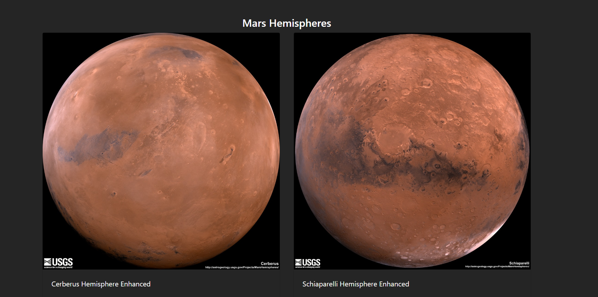
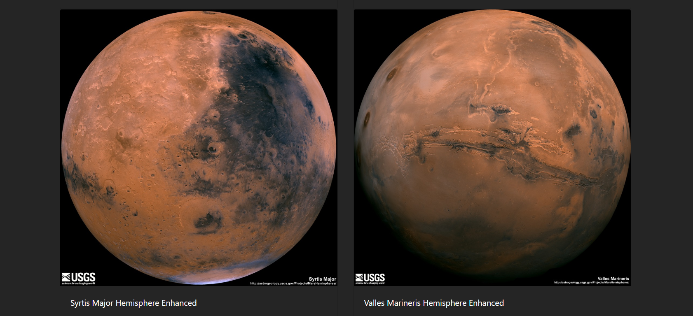

# Web Scraping - Mission to Mars

In this assignment, A web application was built that scrapes various websites for data related to the Mission to Mars and displays the information in a single HTML page. 

## Step 1 - Scraping

Web Scraping was performed on the below web pages using BeautifulSoup, Pandas, and Splinter:

### NASA Mars News

* [NASA Mars News Site](https://mars.nasa.gov/news/) to collect the latest News Title and Paragraph Text. 

### JPL Mars Space Images - Featured Image

* [JPL Featured Space Image](https://www.jpl.nasa.gov/spaceimages/?search=&category=Mars) to collect the url of the featured image.

### Mars Weather

* [Mars Weather twitter account](https://twitter.com/marswxreport?lang=en) to scrape the latest Mars weather tweet.

### Mars Facts

* [Mars Facts webpage](https://space-facts.com/mars/) to scrape the table data containing facts about the Mars

### Mars Hemispheres

* [SGS Astrogeology site](https://astrogeology.usgs.gov/search/results?q=hemisphere+enhanced&k1=target&v1=Mars) to obtain high resolution images for each of Mar's hemispheres.

## Step 2 - MongoDB and Flask Application

Using MongoDB with Flask templating a new HTML page was created that displays all of the information that was scraped. 

